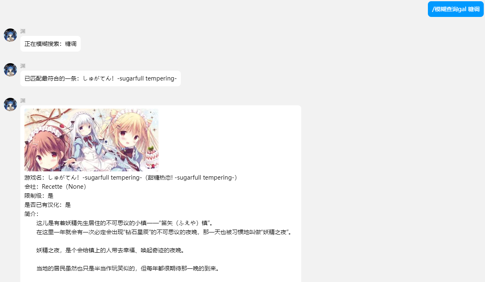

# Astrbot Galgame_Info搜索插件

## ✨ 简介
一个[Astrbot](https://github.com/Soulter/AstrBot)插件，可以提供Galgame的信息查询（接入月幕Galgame的api）

## 📦安装
通过astrbot自带插件商店搜索astrbot_plugins_galinfo一键安装

## ❓注意事项
1.此插件必须在Astrbot的环境下使用

2.查询不到Gal信息请尝试使用模糊搜索或者更改关键词

## ⚙配置

请在Astrbot的控制面板配置

插件管理 -> astrbot_plugins_galinfo -> 操作 -> 插件配置

## ⌨️使用方法
使用【 /查询gal <精准游戏名> 】来搜索游戏

使用【 /查询gal <游戏缩写/别称> 】来模糊搜索游戏

~~未来可能会提供角色查询等~~

## 📌示例

# 支持

[帮助文档](https://astrbot.app)

[月幕Galgame](https://www.ymgal.games/)
